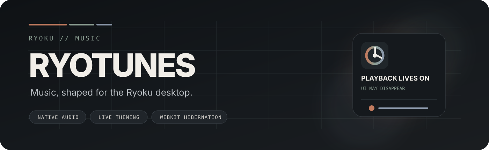
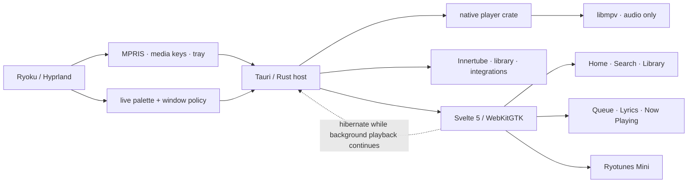

<div align="center">



<br />

<a href="https://github.com/ashmitvoid/ryotunes/releases/latest"></a>
<a href="LICENSE"></a>


<br />


<br /><br />

**A Ryoku-native desktop music player with native audio playback, live shell theming, and a UI that knows when to disappear.**

[Download](https://github.com/ashmitvoid/ryotunes/releases/latest) · [Architecture](docs/ARCHITECTURE.md) · [Install](docs/INSTALL-ARCH.md) · [Troubleshooting](docs/TROUBLESHOOTING.md) · [Ryoku](https://github.com/neur0map/ryoku-arch)

</div>

<br />


<p align="center"><sub>Repository artwork based on the live v2.4 Home layout and Ryoku visual language.</sub></p>

---

## Built for Ryoku, not merely compatible with it

Ryotunes is a Linux-first desktop music application shaped around the way **Ryoku + Hyprland** actually behave.

The visible interface is Svelte/WebKitGTK. Playback is not. Rust and libmpv own the audio session, desktop integration, lifecycle, and media state. That separation lets Ryotunes stay visually rich while open and become dramatically quieter when the main interface is no longer needed.

<table>
<tr>
<td width="33%" valign="top">

### Native where it matters
Audio stays in **libmpv**, outside the frontend renderer. MPRIS, media keys, tray controls, gapless playback and the active session remain native.

</td>
<td width="33%" valign="top">

### Ryoku in real time
**Follow System** consumes Ryoku's live Material-role palette. Named themes and wallpaper-derived colours retint both the main window and mini-player immediately.

</td>
<td width="33%" valign="top">

### Quiet in the background
During background playback, the expensive visible WebKit surface can be **destroyed / hibernated** while the native playback session continues.

</td>
</tr>
</table>

> [!NOTE]
> Ryotunes is intentionally **audio-only**. It does not provide music-video playback.

---

## The experience

| Surface | What Ryotunes does |
|---|---|
| **Home** | Stable, non-virtualized sections, listening console, recommendations and progressive loading without scroll-jitter regressions |
| **Search** | Songs, albums, artists and playlists with bounded incremental loading and preserved navigation state |
| **Library** | Liked music, account playlists, persistent device playlists and local music in the same desktop flow |
| **Radio** | Demand-driven Internet Radio directory with native libmpv live-stream playback |
| **Now Playing** | Artwork-first playback surface with queue, metadata and lyrics access |
| **Lyrics** | Synced lyrics with click-to-seek and mini-player follow mode |
| **Queue** | Manual queue control plus radio / continuation behaviour |
| **Mini-player** | A separate compact Ryoku surface with its own exact Hyprland title and independent geometry |
| **Integrations** | MPRIS, hardware media keys, tray, Last.fm, configurable Discord Rich Presence and optional Listen Together |

---

## Ryoku integration

Ryotunes does not implement a disconnected theme layer and then approximate Ryoku on top of it. The Linux build integrates with the shell directly.

- **Live palette bridge** — Rust resolves Ryoku Material roles and watches Ryoku theme sources with inotify.
- **Immediate theme updates** — no 60-second frontend palette polling loop.
- **Compositor-owned startup geometry** — the main surface is floated, sized and centred by the Ryoku/Hyprland rule before it becomes visible.
- **Mini-player isolation** — the main rule matches the exact title `^(Ryotunes)$`; `Ryotunes Mini` remains independent.
- **MPRIS continuity** — Ryoku media controls remain available when the visible main UI is closed.
- **Rollback-safe replacement packaging** — custom Ryotunes replaces only the stock Ryotunes entry points, never `ryoku-desktop`.

For the shell itself:

**[Ryoku Arch](https://github.com/neur0map/ryoku-arch)** · **[Ryoku Discord](https://discord.gg/8KjBmUEyKA)**

---

## A small lifecycle contract with a big payoff

| Situation | Behaviour |
|---|---|
| Main window open | Full Svelte/WebKit UI is active |
| Close while music is playing | Main WebKit can hibernate; native playback + MPRIS + tray remain alive |
| Tray-only, nothing playing | Application exits after the bounded 5-minute idle period |
| Reopen | Main WebView is reconstructed and resynchronized from native state |
| Explicit **Quit** | Playback stops, MPRIS unregisters, media state clears and backend integrations shut down |

This is why the UI is a **client of playback state**, not the transport clock that owns it.

---

## Architecture



More detail: **[docs/ARCHITECTURE.md](docs/ARCHITECTURE.md)**

---

## Performance is part of the product

Ryotunes treats background efficiency as an architectural requirement, not a cleanup pass.

- event-driven playback state instead of a permanent 100 ms global frontend transport timer;
- no always-on FFT / requestAnimationFrame loop for ordinary idle playback;
- main WebKit hibernation during background playback;
- stable Home DOM — physical Home virtualization is deliberately avoided;
- bounded artwork decode/cache paths;
- native playback state remains authoritative across close, tray, mini-player and reopen transitions;
- Internet Radio discovery is demand-driven — no startup fetch or permanent station polling loop.

The design rules behind the interface are documented in **[docs/DESIGN.md](docs/DESIGN.md)**.

---

## Install

Ryotunes v2.4 targets **x86_64 Ryoku, CachyOS and Arch-based systems**.

Package identity: **`ryotunes-v2.4 2.4.0-1`**.

The normal user path is a **prebuilt package**. End users do not need Node, pnpm, Rust, Cargo or a local Tauri build.

1. Open **[GitHub Releases](https://github.com/ashmitvoid/ryotunes/releases/latest)**.
2. Download `ryotunes-v2.4-2.4.0-1-x86_64.pkg.tar.zst`.
3. Install:

```bash
sudo pacman -U ./ryotunes-v2.4-2.4.0-1-x86_64.pkg.tar.zst
```

The active route is:

```text
/usr/bin/ryotunes
  -> /usr/lib/ryotunes-v2.4/ryotunes
```

The replacement package preserves genuine stock Ryotunes entry points for rollback and restores them when the custom package is removed.

> [!TIP]
> An AUR `-bin` recipe lives in [`aur/`](aur/). Public AUR publication is pending; the repository does not pretend the package is available there before it actually is.

Source/development setup: **[docs/INSTALL-ARCH.md](docs/INSTALL-ARCH.md)**

---

<details>
<summary><b>Repository map</b></summary>

```text
crates/
  innertube/          YouTube Music request/model layer
  player/             native playback core
  listen-protocol/    shared Listen Together protocol
  sync-server/        optional room relay

src-tauri/             Tauri host, lifecycle, MPRIS, tray, integrations
ui/                    SvelteKit / Svelte 5 interface
integrations/          Ryoku / shell integration assets
packaging/             Arch / Ryoku replacement packaging
scripts/               diagnostics, release gates and packaging tools
docs/                  architecture, install, design and troubleshooting
aur/                   binary AUR recipe sources
```

</details>

<details>
<summary><b>Development & validation</b></summary>

The dependency graphs are locked. Release work is expected to pass both frontend and native gates.

```bash
cd ui
pnpm install --frozen-lockfile
pnpm check
pnpm build

cd ..
cargo fmt --all -- --check
cargo test --workspace --locked
cargo check --workspace --locked
cargo tauri build --no-bundle
```

Release checklist: **[docs/RELEASE-CHECKLIST.md](docs/RELEASE-CHECKLIST.md)**

</details>

<details>
<summary><b>Troubleshooting</b></summary>

Start with **[docs/TROUBLESHOOTING.md](docs/TROUBLESHOOTING.md)**.

For a useful bug report, include:

- Ryoku / Hyprland version
- distro and kernel
- Wayland/display-server context
- GPU setup
- steps to reproduce
- bundled diagnostics output when relevant

</details>

---

## Contributing

Contributions are welcome when they preserve the product contracts that make Ryotunes feel native on Ryoku.

Start with **[CONTRIBUTING.md](CONTRIBUTING.md)**. Changes touching playback lifecycle, theme integration, Home rendering, background behaviour or replacement packaging deserve explicit regression testing.

---

## Upstream, license & independence

Ryotunes is a **GPL-3.0-or-later modified work derived from [SimoHypers/LiMusic](https://github.com/SimoHypers/limusic)**.

The project retains transparent upstream attribution while pursuing its own Ryoku-specific product direction, interface, lifecycle, performance architecture and packaging model. See **[UPSTREAM.md](UPSTREAM.md)** for the detailed note.

Ryotunes is independently developed and is **not affiliated with, authorized by, sponsored by, or endorsed by YouTube or Google**. YouTube and YouTube Music are trademarks of Google LLC.

Distributed under **[GPL-3.0-or-later](LICENSE)**.

---

<div align="center">

### Music, shaped for the Ryoku desktop.

<sub>Rust · Tauri 2 · Svelte 5 · WebKitGTK · libmpv · Hyprland</sub>

</div>
