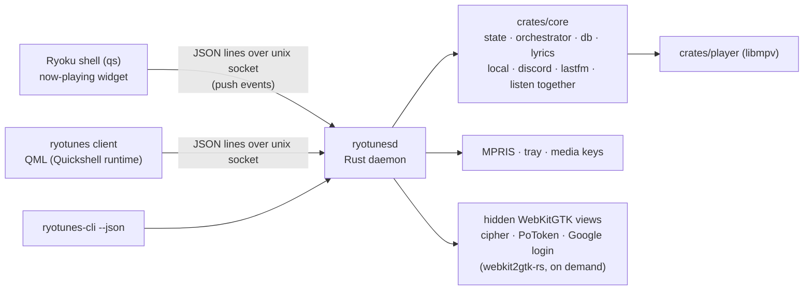

# Ryotunes native client: design

Status: draft for review. Date: 2026-09-05.

## 1. Why

Ryotunes 2.4.1 was measured on the Ryoku dev laptop (Ryzen 9 7940HS, Radeon
780M iGPU driving the 2560x1600@165 panel, RTX 4060 dGPU, Hyprland 0.56.2,
WebKitGTK 2.52.6) before any change:

| State | CPU | Memory |
|---|---|---|
| Window open, idle | ~0% | host 187 MB + UI web process 367 MB + network process 30 MB = 585 MB PSS (880 MB RSS) |
| Playing, Home visible | host 3% + web process 2% | as above |
| Scrolling Home | web process 60% + host 16-19% of one core | UI web process VRAM 198 -> 446 MiB after a few minutes of browsing |
| First track resolved | cipher and PoToken hidden webviews appear | +88 MB and +75 MB PSS (two extra `WebKitWebProcess`), resident while media is loaded, torn down after 300 s idle |

The Rust side is already tuned (`src-tauri/src/lib.rs` `tune_webview`, position
throttling, queue fingerprinting, `malloc_trim`, `vid=no` mpv, hibernation that
really destroys the main webview). What remains is structural:

1. WebKitGTK is the floor: 3 processes, ~450-550 MB PSS for a large SPA, and
   layout+paint of a non-virtualized DOM at up to 165 Hz while scrolling.
2. The GTK host is a second renderer: it composites WebKit's DMA-BUF into a
   GTK3 window (the 12% host main-thread share while scrolling).
3. YouTube's signature/n-transform and PoToken need a real browser engine
   today (see section 6), so two hidden `WebKitWebProcess`es are the price of
   WEB_REMIX playback, not of Tauri.

The backend is the good part: `crates/innertube`, `crates/player` (libmpv),
`crates/listen-protocol`, and in `src-tauri/src` the `state.rs`,
`orchestrator.rs`, `db.rs`, `lyrics.rs`, `local.rs`, `discord.rs`, `lastfm.rs`,
`media.rs`, `radio.rs`, `listentogether/`, `cipher/`, `potoken/` modules
(~21k lines). Tauri coupling is thin and concentrated: `commands.rs` (94
`#[tauri::command]` handlers), `lib.rs`, `tray.rs`, `main_window.rs`,
`webview.rs`, `mini.rs`, `session.rs` (login webview), and `AppHandle::emit`
calls in `state.rs` (10), `media.rs`, `local.rs`, `lastfm.rs`,
`listentogether/`, `ryoku_theme.rs`.

The desktop itself was the larger heat source (Hyprland 75% + `qs` 26% of a
core with Ryotunes quit); that is fixed separately in ryoku-arch
(`heat/idle-drift`) and the GPU mode was switched to hybrid. This document is
about making Ryotunes itself cheap.

## 2. Goals

- Same product, same look: Home, Search, Library, Playlist, Album, Artist,
  Radio, Now Playing, Queue, Lyrics, Settings, the mini player, MPRIS, tray,
  media keys, Last.fm, Discord, Listen Together, local library, Follow System
  theming. `docs/DESIGN.md` stays the design contract.
- Steady state on the dev laptop: client <= 120 MB PSS and ~0% CPU idle,
  daemon <= 100 MB PSS playing (plus the hidden JS helpers only while media is
  loaded), no continuous frame production, scrolling a long list in single
  digits of a core.
- Playback survives the UI: closing the window is `exit(0)` of the client;
  the daemon keeps playing. No destroy/recreate dance, no failsafe timers.
- The Ryoku shell talks to the daemon directly (push events over the same
  socket) instead of polling MPRIS every 500 ms.
- Keep Linux-first. Nothing in the design forbids other platforms, but no
  task is spent on them.

## 3. Non-goals

- Reimplementing the YouTube cipher/PoToken outside a browser engine (section 6
  explains why that is a research project, not a task).
- Video playback, Spotify, or any new provider.
- A new theme system: the client consumes Ryoku's palette singletons.

## 4. Architecture



Three processes at most: the daemon, the client, and WebKit helpers the daemon
spawns on demand. The daemon is the only writer of playback state, the
database, and integrations. The client is a view: it holds no playback truth
and can be killed at any time.

### 4.1 Crates and binaries

| Path | Role | Origin |
|---|---|---|
| `crates/innertube`, `crates/player`, `crates/listen-protocol`, `crates/sync-server` | unchanged | existing |
| `crates/core` | `AppState`, orchestrator, db, lyrics, local, discord, lastfm, media (MPRIS), radio, listentogether, cipher, potoken, session (login), settings. No Tauri. Talks to the outside through three traits (4.2) | moved from `src-tauri/src` |
| `crates/protocol` | request/response/event types, `serde` only, shared by daemon, CLI, tests | new |
| `crates/ryotunesd` | binary: socket server, single-instance lock, systemd-friendly lifecycle, GTK thread hosting the hidden WebKitGTK views, tray | new; absorbs `tray.rs`, `webview.rs`, the login part of `session.rs` |
| `crates/ryotunes-cli` | `ryotunes-cli <method> [json]` and `ryotunes-cli events`; the shell's and scripts' entry point | new |
| `client/` | the QML client run by Quickshell: `qs -c ryotunes` (shipped as `/usr/share/ryotunes/client`), plus `client/mini/` for the mini player window | new, replaces `ui/` |
| `src-tauri/` | deleted at the end of phase 4 | removed |

### 4.2 The three traits `crates/core` talks through

`core` must not know who renders. Everything Tauri provided is one of:

```rust
/// Server-push channel to whoever is listening (the daemon fans out to sockets).
pub trait EventSink: Send + Sync + 'static {
    fn emit(&self, event: &'static str, payload: serde_json::Value);
}

/// A JavaScript environment able to run YouTube's player.js and BotGuard.
/// Implemented by a hidden WebKitGTK view in the daemon (section 6).
#[async_trait::async_trait]
pub trait JsBridge: Send + Sync {
    async fn create(&self, label: &str, harness_html: &str, init_script: &str) -> Result<Box<dyn JsSession>, JsError>;
}
#[async_trait::async_trait]
pub trait JsSession: Send + Sync {
    fn eval(&self, js: &str) -> Result<(), JsError>;
    async fn eval_json(&self, js: String, timeout: Duration) -> Result<serde_json::Value, JsError>;
    async fn call_async(&self, expr: &str, timeout: Duration) -> Result<serde_json::Value, JsError>;
    fn exists(&self) -> bool;
    fn destroy(&self);
}

/// The interactive Google sign-in. Yields cookies + the chosen authuser index.
#[async_trait::async_trait]
pub trait LoginFlow: Send + Sync {
    async fn sign_in(&self) -> Result<LoginResult, LoginError>;
}
```

`webview.rs` already has exactly the `JsSession` shape (`eval`, `eval_json`,
`call_async`, `exists`, `destroy`); `cipher/` and `potoken/` keep calling the
same methods. `tauri::async_runtime::spawn` becomes `tokio::spawn`.

### 4.3 Socket protocol

- Path: `$XDG_RUNTIME_DIR/ryotunes/ryotunesd.sock`, mode 0700 directory, socket
  created under `umask 077` (the ryoku daemon's rule, `ryoku/shell/ipc/daemon.go:178-185`).
- Single instance: `ryotunesd.sock.lock` held with `flock` for the process
  lifetime; a second start connects to the incumbent and asks it to `show`
  (today's `tauri-plugin-single-instance` behaviour).
- Framing: newline-delimited JSON, UTF-8, one object per line, both ways.
- Request: `{"id": 12, "method": "play", "params": {"videoId": "..."}}`.
- Response: `{"id": 12, "result": {...}}` or `{"id": 12, "error": {"code": "upload_unavailable", "message": "..."}}`.
- Event: `{"event": "position", "data": {"position": 12.3}}`. A client opts in
  with `{"id": 1, "method": "subscribe", "params": {"events": ["*"]}}`; the
  daemon replies with the full current state (`get_playback`, `get_queue`,
  `get_settings`, `auth`) so a fresh client resynchronises in one round trip,
  which is what `frontend_ready` does today.
- Methods: the 94 handlers in `src-tauri/src/lib.rs` `generate_handler!`, same
  names, same parameter and result JSON as the `#[tauri::command]` functions in
  `commands.rs` (the Svelte `api.ts` is the reference for shapes), plus four
  control methods: `hello`, `subscribe`, `show` (raise the client window),
  `quit`. Only `frontend_ready`, `open_mini`, `close_mini`, `login_webview`
  change meaning: `frontend_ready` becomes `subscribe`; `open_mini`/`close_mini`
  are client-side; `login_webview` becomes `sign_in` (the daemon opens the
  login window, section 6).
- Events: `playback-state`, `position`, `duration`, `volume`, `now-playing`,
  `queue-changed`, `queue-index`, `stop-after-current`, `playback-error`,
  `playback-notice`, `rating`, `cover-error`, `auth-changed`, `login-done`,
  `login-error`, `account-selection-required`, `local-changed`, `lt-state`,
  `lt-notice`, `ryoku-theme-changed` (kept for non-QML consumers such as the
  shell's own widgets), same payloads as today.
- Cadence: `position` stays at 4 Hz while any client is subscribed to it and
  1 Hz otherwise (today's `PositionThrottle`, keyed on subscriptions instead of
  window visibility).
- Versioning: `{"method": "hello"}` returns `{"protocol": 1, "daemon": "2.5.0"}`;
  a client refuses to run against an older major.

### 4.4 Lifecycle

- `ryotunesd` is a systemd user unit (`ryotunesd.service`, socket-activated
  via `ryotunesd.socket`), started on first client connection. Today's
  behaviours map 1:1: tray-only with nothing playing exits after the bounded
  5-minute idle (`main_window.rs` `IDLE_EXIT_GRACE`); explicit Quit stops
  playback, unregisters MPRIS and exits; the client closing while playing is
  "hibernation" for free.
- The client is `qs -c ryotunes` (a Quickshell config, section 5). The
  `ryotunes` command launches it; a second launch raises the window via the
  daemon (`show`). Hyprland keeps matching the exact title `^(Ryotunes)$` for
  the float-and-centre rule; the mini window keeps `Ryotunes Mini`.

## 5. The client

### 5.1 Runtime: Quickshell, pure QML

The client is a Quickshell configuration, like `ryoku/hub` (`qs -c hub` with a
Go backend) and the shell. Reasons over a C++/Qt host or cxx-qt:

- Zero C++ and zero FFI: Quickshell already gives QML unix sockets
  (`Quickshell.Io.Socket` with `SplitParser` for line framing), processes,
  file views, `FloatingWindow` toplevels, and hot reload.
- The same Qt libraries are resident for the shell (measured reference: a
  Quickshell process with a full-screen surface idles at 83 MB PSS and 0% CPU
  on this laptop).
- Follow System is literally `import Ryoku.Ui.Singletons` and `Theme.*`, the
  palette the shell uses; no inotify bridge, no CSS variable diffing.
- Ryoku's `I18n`, `Motion`, `Perf` (reduce-motion, power tiers) singletons
  apply to the client for free.

Fallback for non-Ryoku hosts is out of scope; the app is Ryoku-native by
charter (`README.md` "Built for Ryoku, not merely compatible with it").

### 5.2 Structure

```
client/
  shell.qml                # Quickshell root: main FloatingWindow + mini window + daemon connection
  Daemon.qml               # Singleton: Socket, request ids, promise-style call(), event signals, reconnection
  Playback.qml             # Singleton: mirrors playback/queue state from events (the client's only state)
  pages/  Home.qml Search.qml Library.qml Playlist.qml Album.qml Artist.qml Radio.qml Settings.qml
  surfaces/ NowPlaying.qml Queue.qml Lyrics.qml PlayerBar.qml Sidebar.qml TopBar.qml
  mini/   Mini.qml
  components/ Artwork.qml Shelf.qml MediaCard.qml TrackRow.qml TrackList.qml (ListView with reuseItems) Chip.qml Hairline.qml
  style/  Tokens.qml (spacing, radii, type scale from ui/src/lib/ryotunes.css) Fonts.qml
```

Rules carried over from `docs/DESIGN.md`, restated for QML:

- Every list is a `ListView` (or `GridView`) with `reuseItems: true` and a
  bounded `cacheBuffer`; Home is one `ListView` of shelves whose delegates are
  horizontal `ListView`s. This is the stable-DOM promise done properly: no
  physical mount/unmount jumps because delegates keep their size.
- No `Timer`/`FrameAnimation` while idle. Lyrics word timing uses one
  `Timer` at 67 ms only while the lyrics surface is visible and playing
  (the current `LyricsView.svelte` rule), stopped otherwise.
- Artwork through `Image { asynchronous: true; cache: true; sourceSize: ... }`
  with the same thumbnail sizing rules as `thumb()` in `ui/src/lib/api.ts`.
- Blur: one `MultiEffect`/`FastBlur` source per surface, never per card, and
  disabled under `Perf.blurDisabled`.
- Motion follows `Perf.reduceMotion` and `Motion` durations.

### 5.3 Mini player

A second `FloatingWindow` in the same config (title `Ryotunes Mini`), toggled
from the player bar; it subscribes to the same `Playback` singleton. The main
window can be hidden while the mini stays.

## 6. JavaScript challenges (cipher, PoToken) and sign-in

Facts established in code (`src-tauri/src/cipher/config.rs:1-18`,
`cipher/extractor.rs:24-38`, `cipher/mod.rs:29-48`):

- The 2025+ VM-dispatch `player.js` has no statically extractable sig/n
  function. rustypipe 0.11's regex + QuickJS path (`rustypipe/src/deobfuscate.rs`)
  and yt-dlp's regexes are dead on the players YouTube serves; Ryotunes,
  like Metrolist, runs YouTube's own 2.9 MB `player.js` in a real browser and
  evaluates a registry-supplied call template (`Ii(25,558,INPUT)`) and the
  player's URL class (`new g.<nClass>(url, true)`) inside the IIFE closure.
  `player.js` initialises against `window`, `document`, `navigator`,
  `location`, timers: a bare QuickJS context cannot run it.
- PoToken is BotGuard: a VM in JavaScript that fingerprints the environment.
  Every non-browser implementation (rustypipe-botguard, bgutil) ships a
  stripped Deno plus a jsdom-class DOM to satisfy it.

Decision for the daemon: keep the hidden-browser mechanism, without Tauri.
`ryotunesd` owns one GTK main loop thread and creates `WebKitWebView`s
through `webkit2gtk-rs` on demand, with the same harness HTML and injection
(`po_token.html`, `cipher/extractor.rs build_injection`), implementing
`JsBridge`/`JsSession`. Cost is unchanged (88 + 75 MB PSS while media is
loaded, released after 300 s idle) and behaviour is identical, which is the
point: the cutover changes the renderer, not the extraction stack.

Sign-in uses the same thread: `LoginFlow` opens a visible `WebKitWebView` in
a GTK window on `accounts.google.com`, with today's navigation allow-list
(`session.rs allowed_login_navigation`) and cookie harvesting, and closes it
on completion. Cookies stay in the daemon; the client never sees them.

Follow-ups, deliberately outside this design, each a bounded task later:

- A "lightweight streaming" setting that puts the PoToken-free clients first
  (`VISIONOS -> ANDROID_VR -> IOS`, `crates/innertube/src/clients.rs`), so no
  hidden browser is ever created, at the cost of WEB_REMIX-only features.
- A Deno-based solver (yt-dlp's `ejs` for the cipher, `rustypipe-botguard`
  for PoToken) as an on-demand subprocess, zero resident memory, once Ryoku
  packages Deno.

## 7. Shell integration

The shell's now-playing widget polls `player.position` every 500 ms
(`ryoku/shell/quickshell/shell/modules/bar/barstyles/qsbar/panels/MprisPanel.qml:46-60`)
and drives cava from PipeWire. With the daemon, `services/Media.qml` can
prefer a `ryotunes` source that connects to the socket and receives
`position`/`now-playing` pushes; MPRIS remains for every other player. This is
a ryoku-arch change and lands after the daemon ships; nothing in the daemon
is shell-specific beyond the socket location.

## 8. Migration

Each phase leaves a working, shippable product.

1. **Core extraction (this plan's sub-project).** Create `crates/core` and
   `crates/protocol`; move the modules; introduce the three traits; the Tauri
   host implements them (`EventSink` = `AppHandle::emit`, `JsBridge` =
   `webview.rs`, `LoginFlow` = `session.rs`). `commands.rs` shrinks to
   one-line forwarders into `core`. Behaviour identical; the release gates in
   `scripts/release-check.sh` and `cargo test --workspace` stay green.
2. **Daemon.** `ryotunesd` with the socket protocol, `ryotunes-cli`,
   webkit2gtk-rs `JsBridge` and `LoginFlow`, MPRIS and tray moved over,
   systemd units, packaging as a second binary in the same package. The
   Tauri app keeps working unchanged (it still embeds `core`), so nothing
   user-visible moves yet.
3. **QML client.** Built against the daemon page by page in `client/`, in
   the order Home, player bar, queue, Now Playing, search, library, playlist,
   album, artist, lyrics, radio, settings, mini. Ships behind a
   `ryotunes --qml` flag until parity, then becomes the default.
4. **Cutover.** Delete `src-tauri/`, `ui/`, the WebKit tuning, the
   hibernation lifecycle, `taskbar.rs`, macOS/Windows configs; packaging
   becomes daemon + client config + desktop entry; `docs/ARCHITECTURE.md`
   rewritten; the Hyprland rule unchanged.

## 9. Verification

Same instruments as the baseline, recorded in the Ryoku vault journal
(`~/.local/share/ryoku/rashin/journal/2026-09-04.md`):

- `top -b -d 5 -n 3 -p <pids>` for CPU; `/proc/<pid>/smaps_rollup` `Pss:` for
  memory; `nvidia-smi` for VRAM and dGPU handles; the per-thread sampler for
  render threads; Hyprland's `debug:overlay` for frames per second.
- Scenarios: idle window open; playing on Home; scrolling Home for 10 s;
  lyrics open while playing; client closed while playing; 30-minute soak.
- Pass criteria: section 2 numbers; no `/dev/nvidia*` handles in client or
  daemon in hybrid GPU mode; zero compositor frames from the client while idle
  (overlay FPS unchanged with the client mapped).

## 10. Risks

- Quickshell as an app runtime: `FloatingWindow` is a first-class type but
  most Quickshell users build layers; keyboard focus, window title, and
  `xdg-decoration` handling must be verified on Hyprland in the first client
  task. Fallback is a 60-line C++ `main.cpp` hosting the same QML; the QML
  does not change.
- webkit2gtk-rs inside a tokio daemon: GTK wants its own thread with a
  `glib::MainLoop`; every WebKit call marshals through `glib::idle_add` and a
  oneshot channel, the pattern `webview.rs` already uses via
  `run_on_main_thread`.
- YouTube rotates players and challenge formats; the design keeps the exact
  current mechanism so the daemon inherits Ryotunes' registry self-heal
  unchanged.
- Two long-lived processes to package and update together: the daemon and
  the client carry the same version and `hello` refuses a mismatch.
